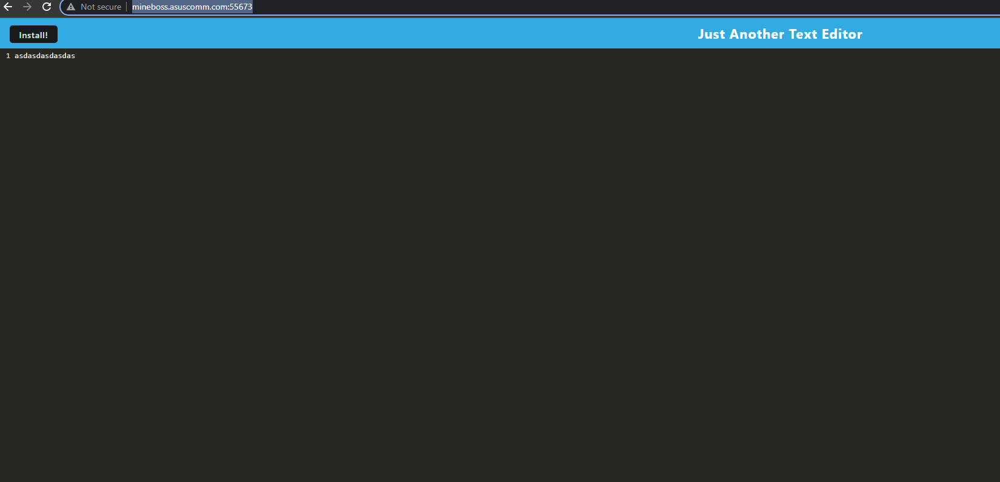

# Elite Web Text Editor

## Description

Very very basick web text editor. Can be used online and offline, also supports local installation so no need for that fancy internet stuffs.

## Table Of Cotents

- [Description](#description)
- [Installation](#installation)
- [Usage](#usage)
- [Deployed](#deployed)

## Installation
To get this up and runing simply download the repo. Extract and navigate your browser to the location of the index.js. Run `npm install` to get the required `npm modules`.

## Usage
Very simple to use first navigate to the folder where it was extracted to. Next run `npm start`.

## Deployed

You can test it out [here](http://mineboss.asuscomm.com:55673/)
